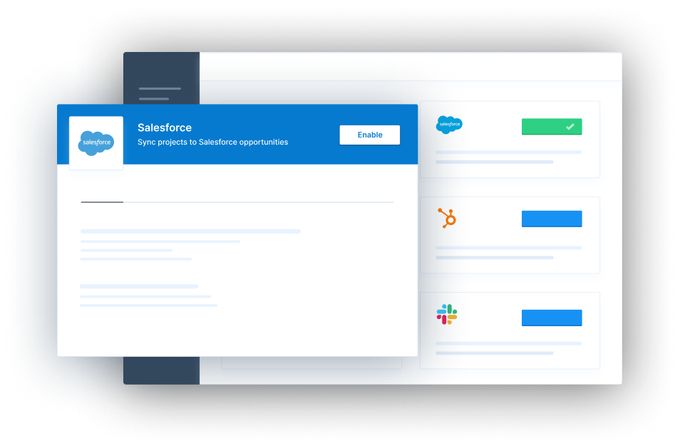

# Paragon

## Overview

Today, third-party integrations are one of the most important parts of building a SaaS application. The average enterprise uses over 1,000 different cloud apps, and customers expect to buy software that integrates seamlessly with their other tools. However, achieving a robust set of high-quality product integrations typically requires anywhere from months to years of engineering work to build and maintain across multiple providers.

**Paragon is an embedded solution for integrating your product with third-party SaaS apps**, providing your customers with a seamless, unified integration experience. This allows teams to avoid the cost, time, and risk that come with building and maintaining their own integrations solution. A single installation of Paragon takes just a couple of hours and enables your application to support integrations with the most popular SaaS apps.

You implement Paragon by adding the Connect SDK to your application, which allows you to display the Connect Portal - a component that your users interact with in order to connect their third-party app accounts. Paragon provides fully managed authentication for each third-party app provider we support, and allows you to access your users' app accounts using Workflows or via the Paragon API.


**New to Paragon?** Start a free 14-day trial of Paragon [**here**](https://dashboard.useparagon.com/signup).


<figure><figcaption></figcaption></figure>

### Examples use cases

* Ingest data from your customers' integration to feed into your LLM
* Sync your customers' Salesforce records to display in your app
* Update your customers' Salesforce records with data from your app
* Send notifications to your customers' Slack workspaces
* Create events in your customers' Google Calendar from events in your app

### Get Started

To install Paragon in your application, follow our **Getting Started** guide below:


[Broken link](broken-reference)


## Explore Paragon Connect

Explore our ready-made Quickstarts or other resources for building with Paragon Connect.


[Broken link](broken-reference)



[integrations](resources/integrations/)



[api-reference](api/api-reference/)


## Build Integrations


[building-a-salesforce-integration.md](tutorials/building-a-salesforce-integration.md)



[building-a-hubspot-integration.md](tutorials/building-a-hubspot-integration.md)



[building-a-slack-integration.md](tutorials/building-a-slack-integration.md)

