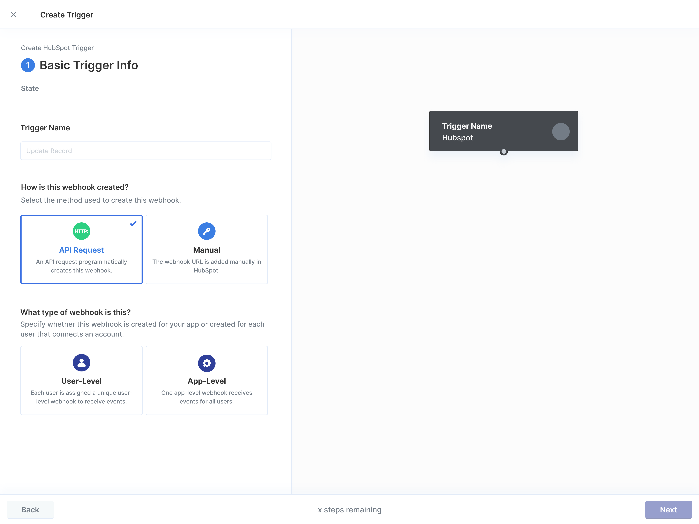

# Custom Webhooks


The Custom Webhooks feature is in a limited _beta_ period for existing Paragon customers in August, 2024. Please [**contact us**](https://www.useparagon.com/book-demo) to request access to the feature.


## Overview

Custom Webhooks allow you to build your own webhook trigger with any integration provider on Paragon, even if they are not natively supported by our native integrations' triggers.

## Building a Custom Webhook

The prerequisites for building a Custom Webhook with any integration provider on Paragon are:

* The integration provider must have a webhook API.
* You have access to the integration provider's webhook API documentation.
* If the integration provider uses OAuth authentication, create a developer account and developer application from the integration provider.
* You have access to a sandbox within the integration provider's service.
* A Paragon account with a **Pro plan** or above.

To start building a Custom Webhook, click the **Triggers** tab from within an integration in your integration catalog in Paragon. You'll need to complete the following steps:

### Step 1. Basic Info

You'll first need to provide some basic information about the webhook that will appear in the Workflow Editor and dictate the trigger's configuration.

**Trigger Name** - A descriptive short name for the webhook, like _Record Created._

**How is this webhook created?** You can usually find this in your integration provider's webhook API documentation.&#x20;

* Select **API Request** if the webhook can be created programmatically using the provider's webhook API.&#x20;
* Select **Manual** otherwise.

**What type of webhook is this?**&#x20;

* Select **User-level** if webhooks are created for each user.
* Select **App-level** if webhooks are created once at the client or application level.

<div align="center">

<figure><figcaption></figcaption></figure>

</div>

### Step 2. Webhook Setup

#### Option 1: Programmatic Webhook API Setup

Describe the API request parameters to create the webhook. This information should be found in the provider's webhook API documentation.

* **Webhook Setup Request URL**
* **Target** - Instruct the webhook provider where to send webhook events by referencing a custom URL associated with your Paragon project to subscribe and receive events. `{{settings.webhookURL}}`&#x20;
* **Authorization** - Defaults to the authentication scheme used for the Paragon integration. If the provider's webhook API authenticates differently, this can be overridden and developer tokens can be referenced from the variable menu.&#x20;
* **Webhook Response** - Customize these options if the provider's webhook API requires a custom response from the webhook recipient server.

You must connect an integration sandbox account to test the request to create the webhook before continuing through the rest of the wizard.

<figure><figcaption></figcaption></figure>

#### Option 2: Manual Setup

Copy the **Webhook Target URL** which you will need to input when you create the webhook trigger in the integration provider's app sandbox or developer portal. For Paragon projects with pre-existing triggers in a given integration, this target link is the same as the one you have already configured to listen for events.

<figure><figcaption></figcaption></figure>


**Manual, User-Level Triggers** will require your app to instruct each of your users to instantiate this webhook in their integration's account manually. Each user will have a unique URL generated by appending their associated `credentialId` as an `id` query parameter, replacing the`/test` path placeholder.&#x20;


Use the `.getUser()` [SDK method](https://docs.useparagon.com/api/api-reference#getuser-paragonuser) to reference the current users' `credentialId` and append that ID to the copied **Webhook Target URL** in the following form:

```
https://hermes.useparagon.com/.../?id={{credentialID}}
```


**Customizing the listener Response Type**

Some integration providers enforce verification – when the webhook is created – requiring the events recipient server to respond in a certain way to prove their authenticity. Use the **Response Type** input to define this behavior.

&#x20;A **Use custom code** option is made available for fully configuring the response behavior and saving any webhook secrets returned by the provider. This function should return an object describing the response with the following properties: `status`, `headers`, and `body`. A `persist` property is available to save incoming request values for reference later in the webhook wizard.

<figure><figcaption></figcaption></figure>

### Step 3. Event Handling

#### **Event Routing**

App-level webhooks require you to match the user-identifying property of the incoming event payload with the existing user ID saved by Paragon. This ensures that incoming events are associated to the correct user. Use the variable menu to reference properties and headers of the incoming event to match against the _Provider ID_ Paragon uses internally to identify tenants of an integration.

#### Payload Verification

Specify how Paragon should process incoming webhook events and validate their authenticity. You can usually find these details in the webhook security or validation sections of their webhook API Documentation.

The most common methods of payload verification are supported as pre-configured options, and a custom code option is provided to allow you to define your own HMAC digest if necessary.

Once you've configured your payload validation method, press the `Listen for events` button to validate the verification. Receiving an event once configuring your payload validation method confirms that your validation is properly configured. You must successfully receive a payload before moving to the next step.

<figure><figcaption></figcaption></figure>

Press the `Finish` button to save your custom trigger.

## Using your Custom Webhooks

Once you've fully configured your custom trigger, you can now access it through the Workflow Builder in the same way as existing integration triggers.

<figure><figcaption></figcaption></figure>

**Testing Workflows with Custom Webhooks**

When testing your workflows with your Custom Webhooks, you must be able to trigger a test event in your integration sandbox to simulate a production scenario. Clicking _Test Step_ on your Custom Trigger will prompt Paragon to listen for a webhook event to be sent to the URL.


