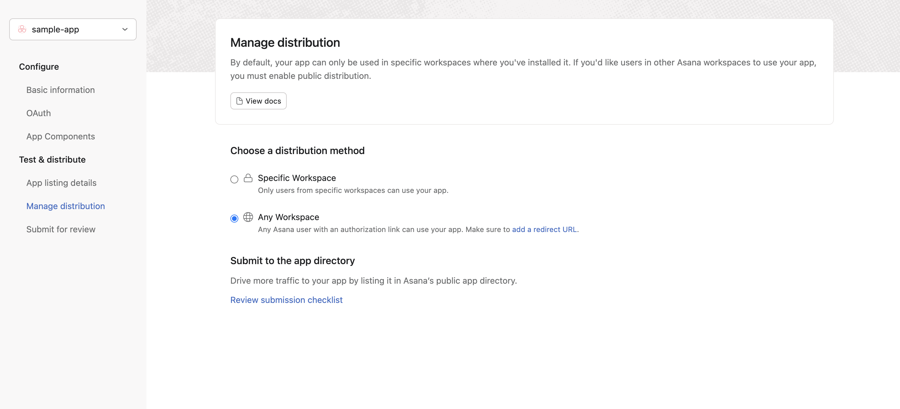

# Asana

## Setup Guide

You can find your Asana app credentials by visiting your [Asana Developer App Console](https://app.asana.com/0/developer-console).

You'll need the following information to set up your Asana app with Paragon:

* Client ID
* Client Secret

### Add the Redirect URL to your Asana app

Paragon provides a redirect URL to send information to your Asana app. To add the redirect URL to your Asana app:

1\. Copy the link under "**Redirect URL"** in your integration settings in Paragon. The Redirect URL is:

```
https://passport.useparagon.com/oauth
```

2\. Log into your [Asana Developer App Console](https://app.asana.com/0/developer-console).

3\. Select the Asana application you'd like to connect to Paragon.

4\. Under **Authorization > Redirect URLs**, paste the Redirect URL provided in Step 1.


**Note:** You'll need to create a new Asana app if you don't already have one



Asana provides you with the **Client ID** and **Client Secret** needed for the next steps after adding the redirect URL to your project.

5\. Under **Test & distribute > Manage distribution** , select **Any workspace** to allow your customers to enable your integration.

<figure><figcaption></figcaption></figure>

### Add your Asana app to Paragon

1\. Select Asana from the **Integrations Catalog**.

2\. Under **Integrations > Connected Integrations >** _**{YOUR\_APP}**_ **>** **Settings**, fill out your credentials from the end of [Step 1](asana.md#add-the-redirect-url-to-your-asana-app) in their respective sections:

* **Client ID:** Found at the end of Step 1.
* **Client Secret:** Found at the end of Step 1.

Press the blue "**Connect**" button to save your credentials.


**Note:** Leaving the Client ID and Client Secret blank will use Paragon development keys.


## Connecting to Asana

Once your users have connected their Asana account, you can use the Paragon SDK to access the Asana API on behalf of connected users.

See the Asana [REST API documentation](https://developers.asana.com/docs/) for their full API reference.

Any Asana API endpoints can be accessed with the Paragon SDK as shown in this example.

```javascript
// You can find your project ID in the Overview tab of any Integration

// Authenticate the user
paragon.authenticate(<ProjectId>, <UserToken>);
            
// List files
await paragon.request("asana", "tasks", { 
  method: "POST",
  body: {
    "name": "Water the plants",
    "due_on": "2019-09-15"
  }
});
```

## Building Asana workflows

Once your Asana account is connected, you can add steps to perform the following actions:

* Create Comment
* Create Project
* Get Projects
* Get Project by ID
* Create Task
* Update Task
* Get Tasks
* Get Task by ID
* Get Task by External ID
* Add Task to Selection
* Get Teams
* Get Workspaces

When creating or updating tasks in Asana, you can reference data from previous steps by typing `{{` to invoke the variable menu.

## Using Webhook Triggers

Webhook triggers can be used to run workflows based on events in your users' Asana account. For example, you might want to trigger a workflow whenever tasks are updated to sync your users' Asana Tasks to your application in real-time.


You can find the full list of Webhook Triggers for Asana below:

* **New Task**
* **Task Updated**
* **Task Completed**
* **Task Deleted**
* **Tag Added**
* **New Project**
* **New Comment**

## Testing Asana workflows

Once you have deployed your workflows and are ready to connect users from other Asana Workspaces to your Asana Application, ensure that you have selected the proper _Distribution method_ for the application.


Seeing an **`invalid_request: The required parameter 'client_id' is missing`**error?

Ensure your Asana application is correctly distributed following these instructions.


In the _**Manage distribution**_ settings of your Asana Application details found in the [Asana Developer App Console](https://app.asana.com/0/developer-console), select the _**Any Workspace**_ distribution method. This will allow Asana users from other Workspaces to connect to your Asana application.

<figure><figcaption></figcaption></figure>
