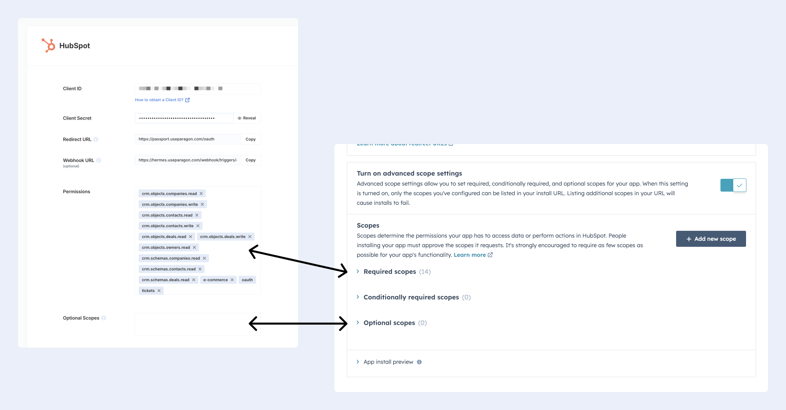

# HubSpot

## Setup Guide

You can find your HubSpot application credentials by visiting your [HubSpot developer dashboard](https://app.hubspot.com/login?hubs\_signup-url=developers.hubspot.com/\&hubs\_signup-cta=cta--small).

You'll need the following information to set up your HubSpot App with Paragon Connect:

* Client ID
* Client Secret
* Scopes Requested

### Prerequisites

* HubSpot Developer Account. You can create one [here](https://app.hubspot.com/signup/developers).
* HubSpot application. Learn more about creating a HubSpot application [here](https://legacydocs.hubspot.com/docs/faq/how-do-i-create-an-app-in-hubspot).&#x20;

### Add the Redirect URL to your HubSpot app

Paragon provides a redirect URL to send information to your app. To add the redirect URL to your HubSpot app:

1\. Copy the link under "**Redirect URL**" in your integration settings in Paragon. The Redirect URL is:

```
https://passport.useparagon.com/oauth
```

2\. Log in to your [HubSpot developer dashboard](https://developers.hubspot.com/).

3\. Click **Manage apps**, then select the app you'd like to connect to Paragon.

4\. Under **Auth > Auth settings > Redirect URL**, paste-in Paragon Connect's redirect URL found in Step 1.

<figure><figcaption></figcaption></figure>

5\. Select any scopes you'd like to use in your application. Note whether the scopes you permit are **required** or **optional** in HubSpot.&#x20;


**Note:** `crm.schemas.custom.read` is a **required** scope to enable Field Mapping in the Connect Portal.


6\. Press the **Save** button at the bottom of the page.

HubSpot provides your **Client ID** and **Client Secret** needed for the next step.&#x20;


### Add your HubSpot app to Paragon

1\. Select **HubSpot** from the **Integrations Catalog**.

2\. Under **Integrations > Connected Integrations > **_**{YOUR\_APP}**_** >** **Settings**, fill out your credentials from the end of [Step 1](hubspot.md#1-add-the-redirect-url-to-your-hubspot-app) in their respective sections:

* **Client ID:** Found under Auth > Auth settings > Client ID on your HubSpot App page.
* **Client Secret:** Found under Auth > Auth settings > Client secret on your HubSpot App page.
* **Permissions:** Select the required scopes you've indicated as _Required scopes_ for your HubSpot application.
* **Optional Scopes**: Select any optional scopes indicated as _Optional scopes_ in your HubSpot application.

Press the blue "**Connect**" button to save your credentials.


**Note:** The scopes you specify in Paragon should exactly match the scopes you permitted in your HubSpot application page.


<figure><figcaption></figcaption></figure>

## Connecting to HubSpot

Once your users have connected their HubSpot account, you can use the Paragon SDK to access the HubSpot API on behalf of connected users.

See the HubSpot [REST API documentation](https://developers.hubspot.com/docs/api/overview) for their full API reference.

Any HubSpot API endpoints can be accessed with the Paragon SDK as shown in this example.

```javascript
// You can find your project ID in the Overview tab of any Integration

// Authenticate the user
paragon.authenticate(<ProjectId>, <UserToken>);
             
// List Companies
await paragon.request("hubspot", "/crm/v3/objects/companies", { 
  method: "GET"
});
  
  
// Create Company
await paragon.request("hubspot", "/crm/v3/objects/companies", { 
  method: "POST",
  body: {
    "properties": {
      "city": "Cambridge",
      "domain": "biglytics.net",
      "industry": "Technology",
      "name": "Biglytics",
      "phone": "(877) 929-0687",
      "state": "Massachusetts"
    }
  }
});
    
```

## Building HubSpot workflows

Once your HubSpot account is connected, you can add steps to perform the following actions:

* Create Contact
* Update Contact
* Search Contacts
* Get Contact by ID
* Create Company
* Update Company
* Search Company
* Get Company by ID
* Create Deal
* Update Deal
* Search Deals
* Get Deal by ID
* Create Engagement

When creating or updating records in HubSpot, you can reference data from previous steps by typing `{{` to invoke the variable menu.

.png>)


## Working with HubSpot Custom Objects and Custom Fields <a href="#custom-objects" id="custom-objects"></a>

It's common that different HubSpot instances may be configured with different Custom Objects or Custom Fields. Paragon provides the ability for your users to choose their own Custom Object mapping.


### Custom Object Mapping

To allow your users to choose their own Custom Object Mapping, add the **Custom Object Mapping** user setting in your Connect Portal Editor. You should give this setting a descriptive user-setting name, for example, if you're mapping contacts from your app to HubSpot, you might call this "Map Contacts to this object".


Below, **add a label for each object property that should be mapped from your app to a HubSpot object field**. In our contacts example, you might add labels for "First Name", "Last Name", and "Email".

In your Connect Portal, your users will be prompted to select an object from their HubSpot instance when enabling this workflow. For each of the object properties you labeled, your users will be prompted to select which object field that property should be mapped to.

In the workflow editor, you can now access your user's custom object mapping in the variable menu. For example:


## Using Webhook Triggers

Webhook triggers can be used to run workflows based on events in your users' HubSpot account. For example, you might want to trigger a workflow whenever new contacts are created HubSpot to sync your users' HubSpot contacts to your application in real-time.


You can find the full list of Webhook Triggers for HubSpot below:‌

* **New Record**
* **Record Updated**
* **Record Deleted**
* **Record Deleted for Privacy (GDPR)**

### **Add the Target URL to your HubSpot app**

Paragon provides a webhook Target URL to subscribe your HubSpot app to events in your users' HubSpot instances. To add the target URL to your HubSpot app:

1.  In the Settings tab of your HubSpot integration in Paragon, copy the link under "**Webhook URL".** \


    <figure><figcaption></figcaption></figure>
2. Log in to your [HubSpot App dashboard](https://app.hubspot.com/develope), select your HubSpot developer account, and navigate to your HubSpot app in **Apps.**
3. In your HubSpot App page sidebar, navigate to **Features > Webhooks**.
4. Provide the "**Target URL.**" Paragon will automatically begin listening to events on behalf of your app.&#x20;
5.  Click **Save** at the bottom of the HubSpot App dashboard.\
    \


    <figure><figcaption></figcaption></figure>

You are now able to **Create subscriptions** against the events you want to subscribe to within HubSpot.

