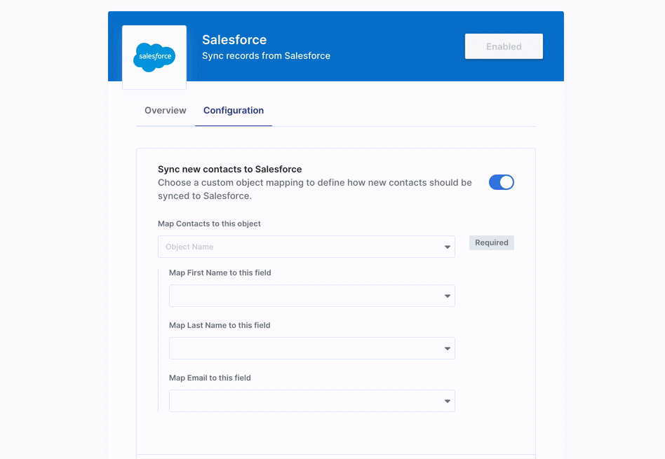
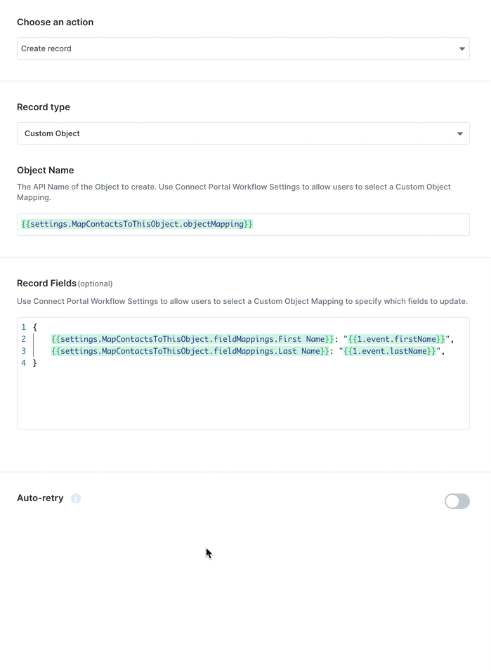
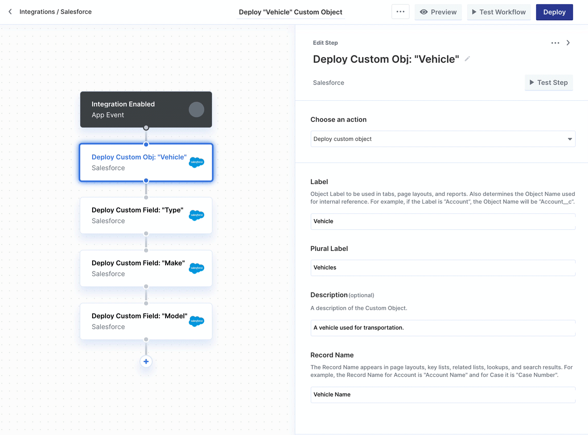

# Salesforce

## Setup Guide

You can find your Salesforce app credentials in your [Salesforce Developer Account.](https://developer.salesforce.com/)

You'll need the following information to set up your Salesforce App with Paragon Connect:

* Consumer Key
* Consumer Secret
* Scopes Requested

### Add the Redirect URL to your Salesforce app

Paragon provides a redirect URL to send information to your app. To add the redirect URL to your Salesforce app:

1\. Log in to your [Salesforce dashboard](https://www.salesforce.com/).

2\. Navigate to the gear icon at the top of the page and click **Setup.**


3\. In the left-hand sidebar, go to **Platform Tools > Apps > App Manager**.


**Note:** You must have the proper admin permissions on your Salesforce account to access the App Manager. If you don't, please speak to your admin.



4\. **Disable “Require Proof Key for Code Exchange (PKCE)”** if it is enabled in your Salesforce Connected App.

5\. Click on the registered application you'd like to use. If you don't already have one, click **New Connected App**.

6\. Under **API (Enable OAuth Settings)**, mark the "**Enable OAuth Settings**" checkbox.

7\. Under **Callback URL**, paste-in Paragon Connect's redirect URL:

```
https://passport.useparagon.com/oauth
```

8\. Select any scopes you'd like to use in your application.

9\. Press the **Save** button at the bottom of the page.

Salesforce provides your **Consumer Key** and **Consumer Secret** needed for the next step once you register your application.&#x20;


### Add your Salesforce app to Paragon

Under **Integrations > Connected Integrations > **_**{YOUR\_APP}**_** >** **Settings**, fill out your credentials from the end of [Step 1](salesforce.md#1-add-the-redirect-url-to-your-salesforce-app) in their respective sections:

* **Consumer Key:** Found under Manage Connected Apps > API (Enable OAuth Settings) > Consumer Key on your Salesforce App page.
* **Consumer Secret:** Found under Manage Connected Apps > API (Enable OAuth Settings) > Consumer Secret on your Salesforce App page.
* **Permissions:** Select the scopes you've requested for your application.


**Note:** Leaving the Client ID and Client Secret blank will use Paragon development keys.



## Connecting to Salesforce


**Note**: Salesforce API access is limited to Enterprise, Unlimited, and Performance Editions of Salesforce, as well as Professional Editions with the paid API add-on. [See Salesforce documentation](https://help.salesforce.com/s/articleView?id=000326486\&type=1) for more information.


Once your users have connected their Salesforce account, you can use the Paragon SDK to access the Salesforce API on behalf of connected users.

See the Salesforce [REST API documentation](https://developer.salesforce.com/docs/) for their full API reference.

Any Salesforce API endpoints can be accessed with the Paragon SDK as shown in this example.

```javascript
// You can find your project ID in the Overview tab of any Integration

// Authenticate the user
paragon.authenticate(<ProjectId>, <UserToken>);
          
// Create an Account
await paragon.request("salesforce", "/sobjects/Account", { 
  method: "POST",
  body: { "Name": "Express Logistics and Transport" }
});


// Query Accounts
await paragon.request("salesforce", "/query/Account", { 
  method: "GET",
  body: { "q": "SELECT+name+from+Account" }
});
  
```

## Building Salesforce workflows

Once your Salesforce account is connected, you can add steps to perform the following actions:

* Create record
* Update record
* Get record by ID
* Search records
* Search records by SOQL query
* Deploy custom object
* Deploy custom field
* Get records by List View

When creating or updating records in Salesforce, you can reference data from previous steps by typing `{{` to invoke the variable menu.


## Working with Salesforce Custom Objects and Custom Fields <a href="#custom-objects" id="custom-objects"></a>

It's common that different Salesforce instances may be configured with different Custom Objects or Custom Fields. Paragon provides the ability for your users to choose their own Custom Object mapping. You can also deploy Custom Objects or Custom Fields that may be specific to your application to your users' Salesforce instances.



### Custom Object Mapping

To allow your users to choose their own Custom Object Mapping, add the **Custom Object Mapping** user setting in your Connect Portal Editor. You should give this setting a descriptive user-setting name, for example, if you're mapping contacts from your app to Salesforce, you might call this "Map Contacts to this object".


Below, **add a label for each object property that should be mapped from your app to a Salesforce object field**. In our contacts example, you might add labels for "First Name", "Last Name", and "Email".

In your Connect Portal, your users will be prompted to select an object from their Salesforce instance when enabling this workflow. For each of the object properties you labeled, your users will be prompted to select which object field that property should be mapped to.

In the workflow editor, you can now access your user's custom object mapping in the variable menu. For example:



### Deploying Custom Objects or Custom Fields

To deploy Custom Objects or Custom Fields to your users' Salesforce instances, use the **Deploy Custom Object** or **Deploy Custom Field** Salesforce workflow actions.&#x20;

Both **Deploy Custom Object** and **Deploy Custom Field** will upsert by default, for example, if you run **Deploy Custom Field** on an existing Custom Field, it will apply any relevant updates to the Custom Field.



### Referencing Custom Objects and Fields

You can reference any Salesforce object (provided that the object exists in your user's Salesforce instance) when creating, updating, or searching records by selecting **Custom Object** under **Record Type** and referencing the **Object Name**.&#x20;

Similarly, you can reference any Salesforce field (provided that the field exists on the target object) when creating or updating records.

The Object Name for Custom Objects and the Field Name for Custom Fields are both suffixed with `__c`.&#x20;


## Using Webhook Triggers

Webhook triggers can be used to run workflows based on events in your users' Salesforce account. For example, you might want to trigger a workflow whenever new contacts are created in Salesforce to sync your users' Salesforce contacts to your application in real-time.


You can find the full list of Webhook Triggers for Salesforce below:

* **New Record**
* **Record Updated**
* **Campaign Member Added**
* **Campaign Opportunity Added**
