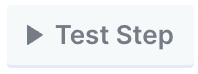

# Request Pagination

Integration APIs commonly enforce limits for how many results can be returned in a single request. When you need to access more results, the API will provide a value in the response to use in your next request to get the next page of results.

Our native [Integration Actions](../integration-actions.md) use pagination automatically, but Request and Integration Request steps can also be configured to page across multiple requests.

Request steps with Pagination will wait until all requests for data have been completed before proceeding in the workflow.

## Configuring Pagination

[Some native Paragon integrations](request-pagination.md#integrations-supporting-pre-configured-pagination) include pre-configured pagination. For these integrations, toggling **Pagination** will enable the pre-configured strategy, and you can optionally configure the Limit, Skip, and Previous Page options.

* **Limit:** Specify a numerical record limit of records to fetch.
* **Skip:** Specify a numerical record offset indicating where to start request pagination.
* **Previous Page:** Specify a page token indicating where to start request pagination.

<figure><figcaption></figcaption></figure>

For integrations that do not support pre-configured pagination, you can still configure your request with [#custom-pagination](request-pagination.md#custom-pagination "mention").

### Custom Pagination

Before configuring Custom Pagination, press Test Step () in your Request to make sure that you have Test Data to work with. This will be required to select fields from the output to configure subsequent, paginated requests.

After confirming that this step has Test Data, turn on the **Pagination** switch (below Authorization) for the Request step.

Custom Pagination requires you to configure 3 values:

* **Output:** Select the field from Test Data that represents a single page of results. Output must be an Array-type value, which will be aggregated across the paginated requests.
* **Page Token**: Select a field from Test Data to use as a parameter for subsequent requests.
* **Stop When**: Specify a condition for when request pagination should end. For example, "`.nextPageToken` Is `null`".

Finally, you'll need to use the **Page Token** value in the Request step configuration to make paginated requests fetch the next page of available data.

For example, if the API expects you to pass the Page Token as a query parameter called `cursor`, you can add this parameter to your request with the value `{{self.pageToken}}`.

<figure><figcaption></figcaption></figure>

### Testing

You can test your Request Pagination by clicking Test Step () after configuring the above options.

In test mode, Request steps will only attempt to page once after the initial request. Verify that your request is paging correctly by checking the output array.

## Auto-Retry and Errors

Requests that use Pagination will automatically attempt to retry requests that fail due to rate limits with an exponential backoff strategy.

If pagination cannot continue, then the step will provide the partial set of results that it successfully requested alongside the final error that occurred before the Request step.

**Example output:**

```
{
    "response": {
        "results": [...],
        "error": {
            "message": "401 - Unauthorized"
        }
    }
}
```

To handle errors from Request steps using Pagination, you can use a Conditional step to check for the presence of the `error` field before continuing the workflow.

## Task Usage

Each page fetched in a Request step with Pagination configured will consume 1 task. For example, a Request that uses 150 requests to fully page through your user's data will consume 150 tasks.

You can configure your request to use larger page sizes (as allowed by the integration) to reduce the number of tasks that your Request step consumes.

## Tutorial: Using Pagination for Slack channels

As an example of configuring Request Pagination, we'll implement a workflow that uses Slack's API to get all channels from a Slack workspace.

The API endpoint we will use is `conversations.list` ([see Slack documentation](https://api.slack.com/methods/conversations.list)).

Slack allows for a maximum of 1000 channels to be retrieved at a time, but recommends no more than 200:

> This method uses cursor-based pagination to make it easier to incrementally collect information. To begin pagination, specify a `limit` value under `1000`. We recommend no more than `200` results at a time.
>
> Responses will include a top-level `response_metadata` attribute containing a `next_cursor` value. By using this value as a `cursor` parameter in a subsequent request, along with `limit`, you may navigate through the collection page by virtual page.

1.  Start by creating a Slack Request step in a workflow and configuring it to use `conversations.list` in the URL.\


    <figure><figcaption></figcaption></figure>

    Click **Test Step** to see the output of this step and confirm that you see Slack channels from your connected Preview account.\

2. Next, turn on Pagination. You will see 3 new fields appear to configure: Output, Page Token, and Stop When.
   1.  Set **Output** to the array of channel results by clicking on the Output field and using `{{` to open the variable menu. Select the `response.body.channels` field from Test Data.

       <figure><figcaption></figcaption></figure>
   2. Set **Page Token** to the field that will be used as the "cursor" field of the request. Slack returns the result in `response.response_metadata.next_cursor`, as mentioned in their documentation quoted above.
   3. Set **Stop When** to "`response.response_metadata.next_cursor` does not exist". This means that we will stop paging for additional results when Slack does not send us a `next_cursor` value in the last response.\

3.  According to the Slack documentation quoted above, we can request the next page with the `cursor` query parameter. Add `cursor` to the **URL Parameters** and use `{{` to open the variable menu and set the value to **Page Token**.

    <figure><figcaption></figcaption></figure>
4. Test the step again to verify that pagination is working as intended. Any errors that occur during pagination will appear in Test Data.

## Integrations Supporting Pre-configured Pagination

* Asana
* Salesforce
* SharePoint
* Dynamics Business Central
* Dynamics 365 Finance
* Dynamics 365 Sales
* Microsoft Teams
* Outlook
* OneDrive
* Azure DevOps
