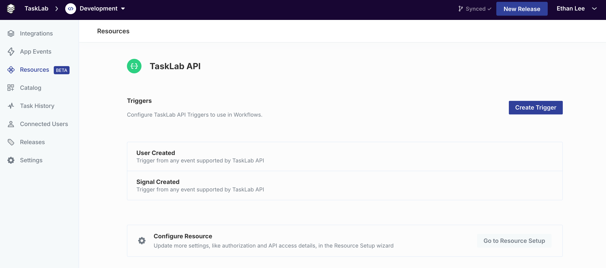

# API Resource Trigger

API Resource Triggers are triggers configured to use your API's webhooks to start workflows. To use this trigger, you must have an API Resource configured: [api-resources.md](../../resources/api-resources.md "mention").

## Defining an API Resource Trigger

To start creating an API Resource Trigger, open your Resource in the dashboard and click **Create Trigger**.

<figure><figcaption></figcaption></figure>

The Custom Webhook setup page will open and prompt you to define the trigger setup details. See more about how to use the Custom Webhook setup here: [custom-webhooks.md](../../resources/custom-webhooks.md "mention")

## Using an API Resource Trigger

To use an API Resource Trigger in a workflow, click your Resource name in the trigger types and select the trigger that you defined.


**Note:** Only fully-configured triggers that have completed the Custom Webhook setup will appear in this menu.


<figure><figcaption></figcaption></figure>

## Webhook Subscriptions

For user-level API Resource triggers, the webhook will subscribe when a Connected User has successfully established a Resource Connection via [`connectAction`](../../resources/api-resources.md#connecting-resources) in the SDK and has enabled at least one workflow which is triggered by an API Resource trigger.

The webhook subscription will only be created once per unique API Resource trigger type. However, one webhook event can trigger multiple workflows connected to the same trigger type.

